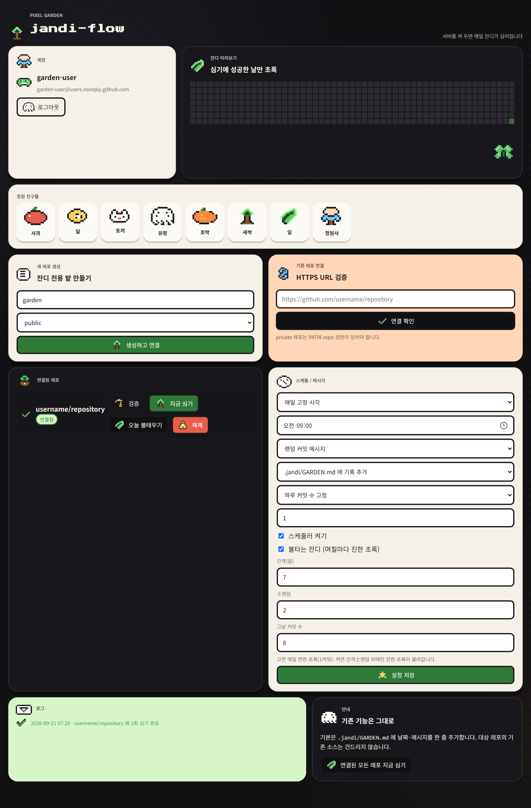
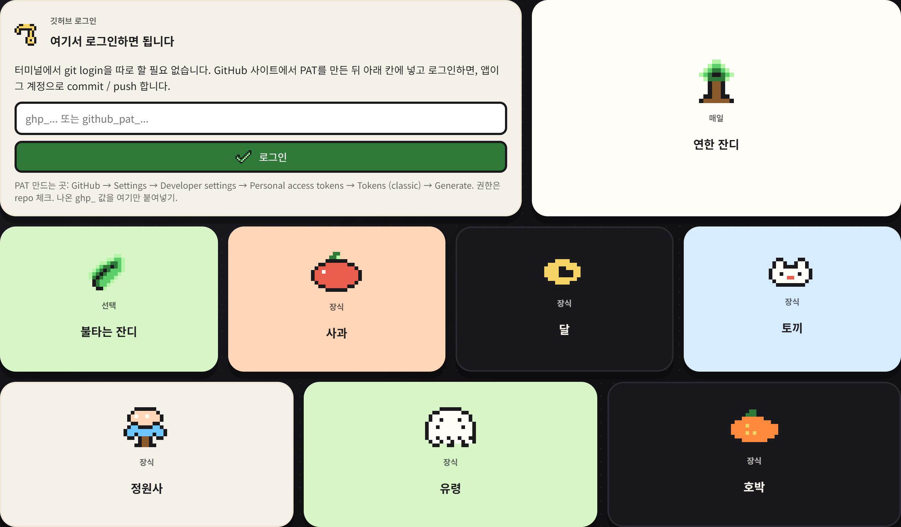
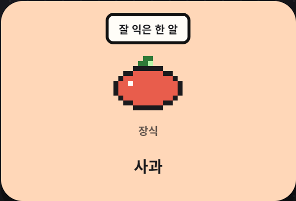
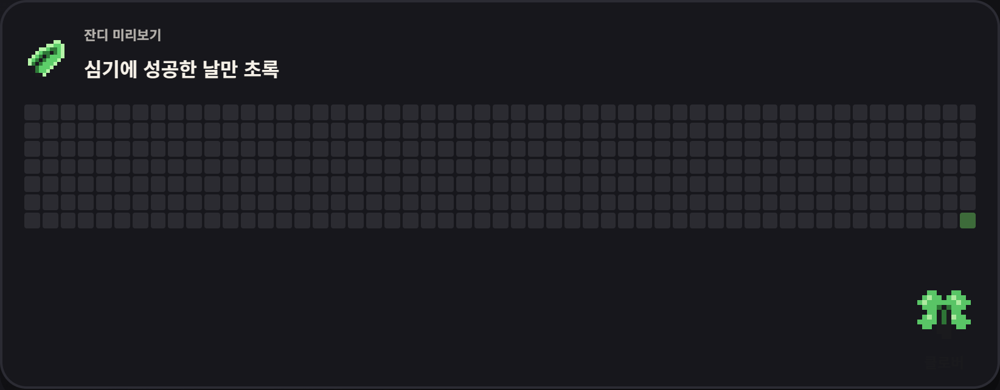
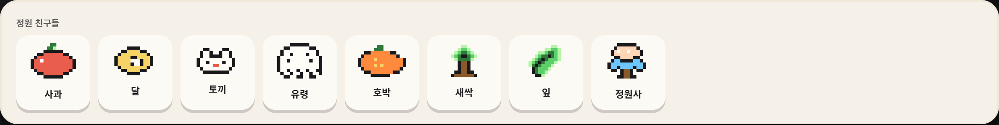
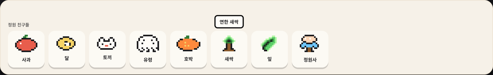
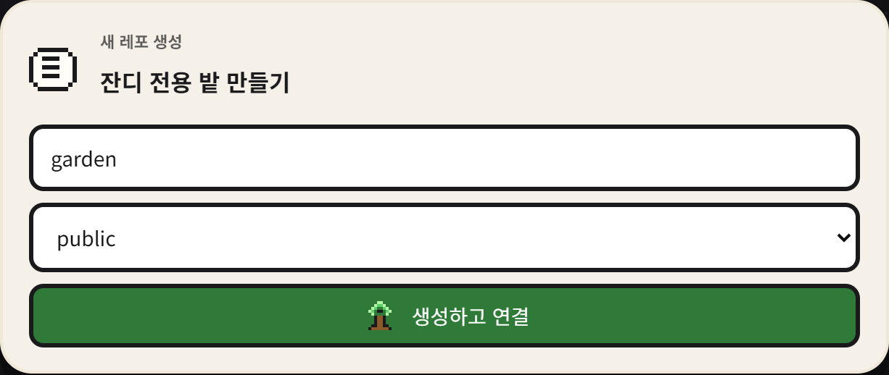
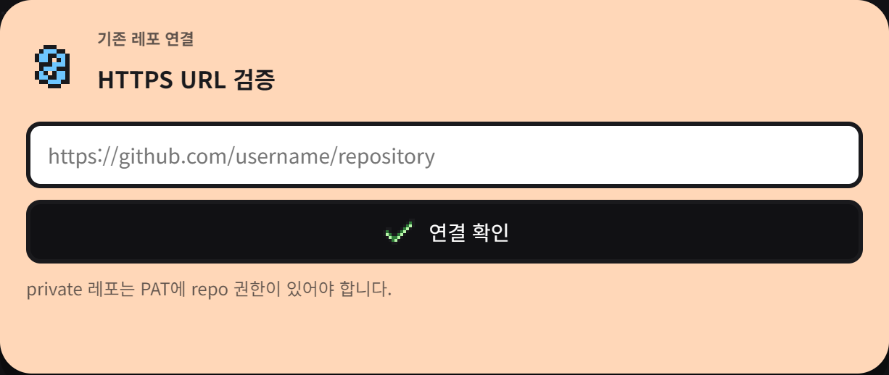
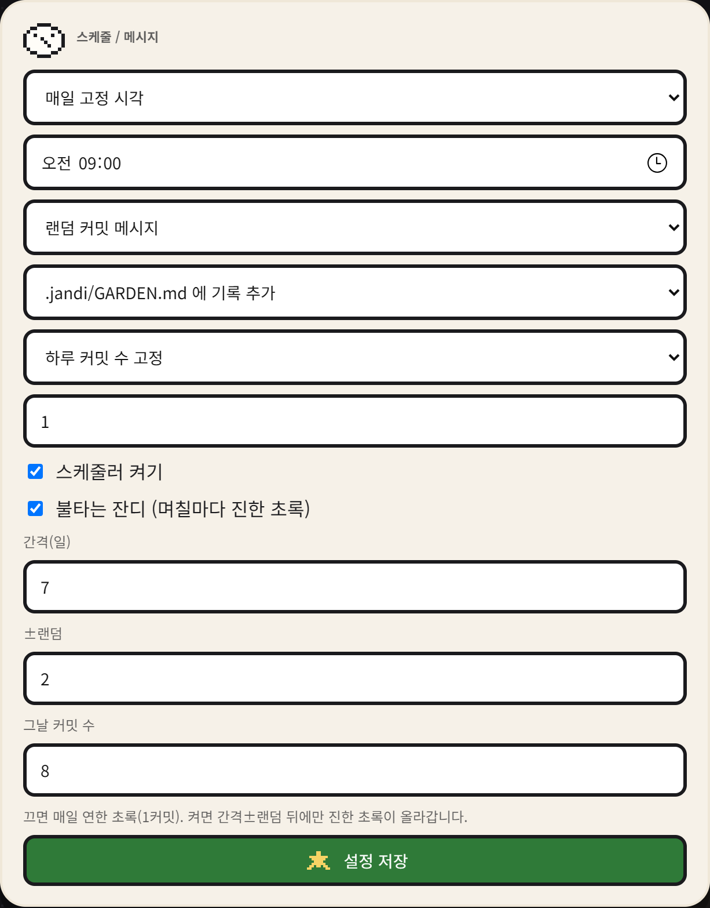
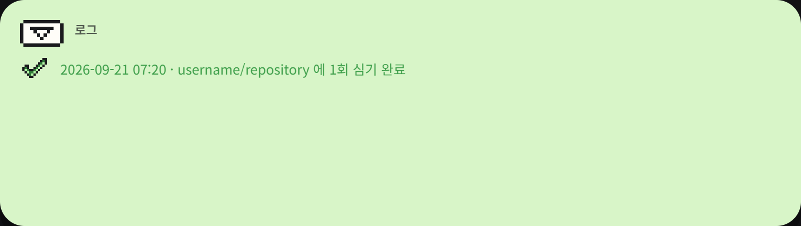

# jandi-flow

매일매일 Git **잔디**를 심어주는 도구

로컬에서 서버를 켜 두면, 지정한 시각 또는 하루 중 랜덤한 시각에 연결된 GitHub 레포로 commit / push 가 올라갑니다. 기존 소스와 기능은 수정하지 않습니다. 기본은 `.jandi/GARDEN.md` 에 날짜와 메시지를 한 줄 추가하는 커밋입니다.

공개 저장소: [min2h/jandi-flow](https://github.com/min2h/jandi-flow)

## 화면

다크 배경 위의 픽셀 타일 모자이크입니다. **앱 화면의 PAT 입력이 GitHub 로그인**입니다. 터미널 `git login` / `gh auth` 는 필요 없습니다.

아래 캡처는 `/?preview=1` 미리보기입니다. 계정·레포 이름은 가명(`garden-user`, `username/repository`)이라 개인정보가 없습니다. 로그인 없이 레이아웃만 보려면 같은 주소를 열면 됩니다.

### 로그인 후 한눈에



로그인에 성공하면 계정, 잔디 미리보기, 정원 친구들, 레포 생성/연결, 스케줄, 로그가 한 화면에 붙습니다. 상단 제목은 **jandi-flow** (잔디).

| 구역 | 하는 일 |
| --- | --- |
| **계정** | 지금 로그인한 GitHub 계정. **로그아웃**으로 PAT 세션을 지웁니다. |
| **잔디 미리보기** | 이 앱이 심은 날만 초록 칸. GitHub 프로필 잔디의 축소판이 아니라 로컬 실행 기록입니다. |
| **정원 친구들** | 사과·달·토끼 등 픽셀 장식. 올리면 툴팁, 올리거나 누르면 각자 다른 움직임. |
| **잔디 전용 밭 만들기** | 새 레포 이름과 public/private 을 고른 뒤 **생성하고 연결**. |
| **HTTPS URL 검증** | 이미 있는 레포 `https://github.com/owner/repo` 를 붙여 넣고 연결합니다. |
| **연결된 레포** | 상태 표시. **지금 심기**(연한 잔디), **오늘 불태우기**(진한 잔디), **해제**. |
| **스케줄 / 메시지** | 시각, 커밋 메시지, `.jandi/GARDEN.md` 기록(기본) 또는 빈 커밋, 하루 커밋 수, 불타는 잔디. |
| **로그** | 심기 성공/실패 시각과 메시지. |
| **안내** | 대상 레포 기존 소스는 그대로. **연결된 모든 레포 지금 심기**. |

### 로그인



로그아웃 상태에서는 왼쪽 **깃허브 로그인** 타일과 오른쪽·아래 정원 타일만 보입니다.

1. GitHub → Settings → Developer settings → Personal access tokens → Tokens (classic)
2. **`repo`** 권한으로 토큰을 만들고 `ghp_...` 를 복사
3. 앱의 PAT 칸에 붙여넣고 **로그인**
4. 성공하면 계정 타일(아바타, 로그인, noreply 메일)과 잔디 미리보기가 바로 나옵니다

PAT는 로컬 `data/` 에만 암호화되어 저장됩니다. 채팅·이슈·README에 붙이지 마세요.

로그인 칸 옆의 **연한 잔디** / **불타는 잔디** 는 기능 설명용 타일입니다. 사과·달·토끼·정원사·유령·호박은 분위기 장식입니다. 화면에 “올리거나 누르세요” 같은 안내는 없습니다.

### 툴팁



마우스를 타일이나 정원 친구 위에 올리면 짧은 툴팁만 뜹니다. 예: 사과 → `잘 익은 한 알`, 달 → `정원 위 초승달`. 연한 잔디·불타는 잔디도 같은 방식으로 `하루 한 칸, 연한 초록` / `며칠마다 진한 초록` 이 나옵니다.

### 잔디 미리보기



이 앱이 **심기에 성공한 날**만 칸이 초록으로 채워집니다.

- 연한 초록: 평소 `지금 심기` 또는 매일 스케줄(기본 1커밋)
- 진한 초록: **불타는 잔디**가 켜진 날, 또는 **오늘 불태우기**
- 빈 칸: 아직 심지 않은 날

오른쪽 아래 클로버는 장식입니다. GitHub 프로필 잔디와 날짜가 다를 수 있습니다. 여기 기록은 로컬 실행 로그 기준입니다.

### 정원 친구들





로그인 뒤에는 같은 픽셀 친구들이 한 줄로 모여 있습니다. 이름만 보이고, 올리면 `연한 새싹`처럼 짧은 설명이 **한 줄**로 뜹니다. 각자 움직임이 다릅니다.

| 친구 | 올리면 | 누르면 |
| --- | --- | --- |
| 사과 | 흔들림 | 톡 떨어짐 |
| 달 | 노란 빛 | 한 바퀴 |
| 토끼 | 귀 움직임 | 폴짝 |
| 유령 | 떠다님 | boo |
| 호박 | 주황 빛 | 통통 |
| 새싹 | 자라남 | 톡 올라옴 |
| 잎 | 살랑 | 한 바퀴 |
| 정원사 | 손 흔들기 | 폴짝 |
| 클로버 | 살랑 | 한 바퀴 |

키보드 Enter / Space 로도 재생됩니다. OS에서 움직임 줄이기를 켜면 애니메이션은 꺼집니다.

### 새 레포 생성



잔디 전용 레포를 새로 만들 때 씁니다. 이름과 public/private 을 고른 뒤 **생성하고 연결**을 누르면 GitHub에 레포가 생기고, 이 앱 연결 목록에 바로 들어갑니다. 이미 있는 레포의 소스/기능은 건드리지 않습니다. 새 레포도 기본 커밋은 `.jandi/GARDEN.md` 한 파일만 만집니다.

### 기존 레포 연결



이미 있는 레포를 붙일 때 씁니다. `https://github.com/owner/repo` 를 넣고 **연결 확인**을 누르면 앱이 그 URL이 실제로 있는지, 지금 PAT로 읽을 수 있는지, push 가 가능한지 검사합니다.

- public / private 모두 가능
- private 은 PAT에 classic **`repo`** 권한이 있어야 합니다. `public_repo`만 있으면 실패합니다
- 잘못된 URL, 없는 레포, 권한 부족은 연결되지 않고 상태 타일에 이유가 남습니다

플레이스홀더는 `https://github.com/username/repository` 처럼 가명입니다. 본인 계정 URL을 화면에 미리 넣어 두지 않습니다.

### 연결된 레포


연결이 끝난 레포마다 상태와 버튼이 붙습니다.

| 버튼 / 상태 | 의미 |
| --- | --- |
| **연결됨** | PAT와 레포가 정상이라 심을 수 있음 |
| **레포 없음** | URL의 레포가 삭제되었거나 이름이 바뀜 |
| **인증 실패** | PAT가 만료·철회되었거나 권한이 부족 |
| **push 불가** | 읽기는 되지만 이 토큰으로 push 가 거절됨 |
| **검증** | 지금 다시 health check |
| **지금 심기** | 연한 잔디. 기본 1커밋, `.jandi/GARDEN.md` 한 줄 |
| **오늘 불태우기** | 진한 잔디. 설정한 개수만큼 여러 커밋 |
| **해제** | 이 앱에서만 연결을 끊음. GitHub 레포는 지우지 않음 |

연결은 저장 전과 매일 실행 직전에 다시 검증합니다. 레포가 사라지거나 토큰이 바뀌면 그날은 심지 않습니다.

### 스케줄 / 메시지



매일 자동으로 심는 시각과 커밋 내용을 정합니다. **설정 저장**을 눌러야 반영됩니다.

| 항목 | 설명 |
| --- | --- |
| **매일 고정 시각** | 예: 09:00 (Asia/Seoul) |
| **매일 랜덤 시각** | From ~ To 사이 아무 때나 한 번 |
| **커밋 메시지** | 고정 문장 또는 앱이 고르는 랜덤 문장 |
| **커밋 방식** | `.jandi/GARDEN.md` 에 기록 추가(기본) / 빈 커밋 |
| **하루 커밋 수** | 평소 연한 잔디. 고정 또는 랜덤 |
| **스케줄러 켜기** | 끄면 자동 심기를 멈춤. 버튼으로 수동 심기는 가능 |
| **불타는 잔디** | 며칠 ±랜덤 뒤에만 여러 커밋으로 진한 초록. 끄면 매일 연한 초록만 |

기본 커밋 방식은 빈 커밋이 아닙니다. 대상 레포에 `.jandi/GARDEN.md` 가 생기고, 심을 때마다 아래처럼 한 줄이 붙습니다.

```md
# jandi-flow garden

이 파일은 잔디 심기 기록입니다. 앱이 commit 할 때마다 한 줄을 추가합니다.
대상 레포의 기존 소스와 기능은 수정하지 않습니다.

## 기록

- 2026-09-21 06:31:00 UTC · 오늘도 잔디 한 칸
```

GitHub 커밋 화면에서 파일 diff 가 보여야 정상입니다. 빈 커밋이 필요하면 설정에서 바꿀 수 있습니다.

### 로그



심기·불태우기·실패가 시간 순으로 쌓입니다. 초록 줄은 성공, 빨간 줄은 실패 이유입니다. 잔디 미리보기의 초록 칸은 이 성공 기록을 날짜로 모은 것입니다.

## 바로 실행

필요: Node.js 20+, Git, GitHub PAT (`repo` 권한. public만 쓰면 `public_repo` 가능)

```bash
git clone https://github.com/min2h/jandi-flow.git
cd jandi-flow
npm install
copy .env.example .env
npm run dev
```

브라우저에서 [http://127.0.0.1:5173](http://127.0.0.1:5173) 을 엽니다. 서버 API는 `8787`입니다.

`.env`의 `JANDI_SECRET`은 비워 두면 첫 실행 때 자동 생성됩니다. **이 값과 PAT는 git에 올리지 마세요.**

Docker:

```bash
copy .env.example .env
docker compose up --build
```

이후 [http://127.0.0.1:8787](http://127.0.0.1:8787)

## 사용 순서

1. 브라우저에서 GitHub 로그인
2. Settings → Developer settings → Personal access tokens → Tokens (classic) → Generate new token
3. 권한에서 **`repo`** 체크 후 생성. 화면에 나온 `ghp_...` 복사
4. jandi-flow 화면 로그인 칸에 붙여넣고 **로그인** (채팅에 붙이지 않기)
5. 새 레포 생성, 또는 기존 레포 HTTPS URL 연결
6. 스케줄/메시지 저장. `지금 심기`로 바로 commit / push 확인

앱이 저장한 PAT로 `git commit` 과 `git push` 를 대신 실행합니다.

### private 테스트 레포

이미 만든 테스트용 private 레포가 있다면 이렇게 확인합니다.

1. GitHub PAT는 **classic `repo`** (private 읽기/쓰기). `public_repo`만 있으면 private 연결이 실패합니다.
2. [http://127.0.0.1:5173](http://127.0.0.1:5173) 에서 PAT 로그인
3. **기존 레포 연결**에 `https://github.com/owner/repository` 붙여넣고 연결 확인
4. 상태 타일이 `연결됨` 인지 확인
5. `지금 심기` = 연한 잔디(1커밋). `오늘 불태우기` = 진한 잔디(여러 커밋)
6. 해당 레포 Commits 에서 `.jandi/GARDEN.md` 변경과 프로필 잔디칸을 확인

## 옵션

| 항목 | 필수 | 설명 |
| --- | --- | --- |
| GitHub PAT | 필수 | 로컬 `data/`에만 암호화 저장 |
| 대상 레포 | 필수 | 생성 또는 HTTPS URL 연결. public/private 모두 |
| 스케줄 | 필수 | 매일 고정 시각 또는 랜덤 윈도우 (기본 Asia/Seoul) |
| 커밋 메시지 | 필수 | 고정 문장 또는 랜덤 목록 |
| 하루 커밋 수 | 선택 | 평소 연한 잔디는 1커밋 |
| 불타는 잔디 | 선택 | 며칠 ±랜덤 뒤에 여러 커밋으로 진한 초록. 끄면 매일 연한 초록 |
| 커밋 방식 | 선택 | `.jandi/GARDEN.md` 기록(기본) / 빈 커밋 |
| 여러 레포 | 선택 | 연결한 모든 URL에 매일 심기 |

## 올리지 않는 것

`.gitignore`가 막습니다.

- `.env` (실제 `JANDI_SECRET`)
- `data/` (DB, 암호화된 PAT, 로컬 클론)
- `*.pem` / `*.key`
- `node_modules/`

저장소에는 `.env.example`만 있습니다.

## 주의

- 이 PC가 켜져 있고 `npm run dev` 또는 `docker compose up`이 살아 있어야 매일 심깁니다.
- 기여 그래프에  verd려면 커밋 이메일이 GitHub 계정과 맞아야 합니다. 공개 이메일이 없으면 `로그인@users.noreply.github.com`을 씁니다.
- 잔디 커밋은 앱이 연결한 **대상 레포**로만 갑니다. 이 제품 저장소(`jandi-flow`)에 더미 커밋을 섞지 않습니다.
- PAT를 이슈/README/채팅에 붙여 넣지 마세요.

## 테스트

```bash
npm test
```

로그인 성공/실패, 레포 생성, URL 연결(public/private/잘못된 URL/404/push 불가), 스케줄, 메시지, 정원 기록 파일, 실행 중 레포 삭제, 키 변경, 시크릿이 git에 안 들어가는 경우를 검사합니다.
